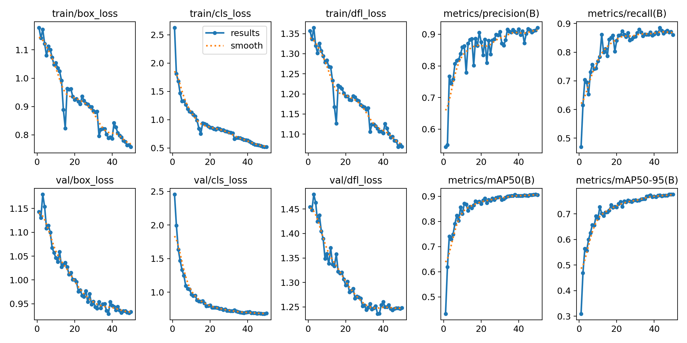
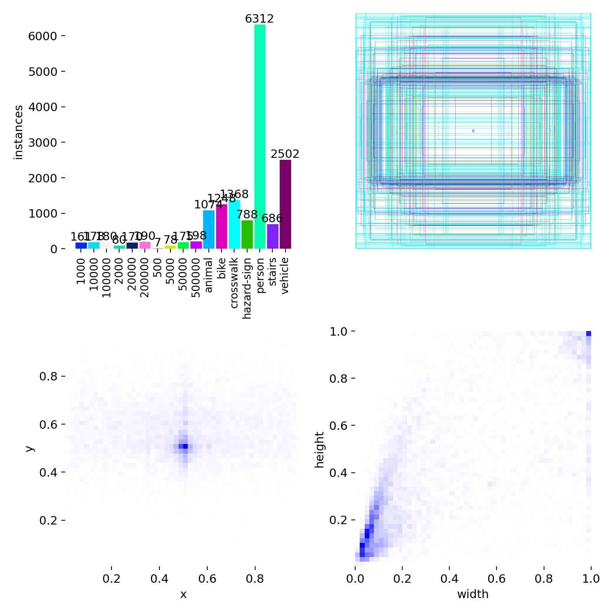
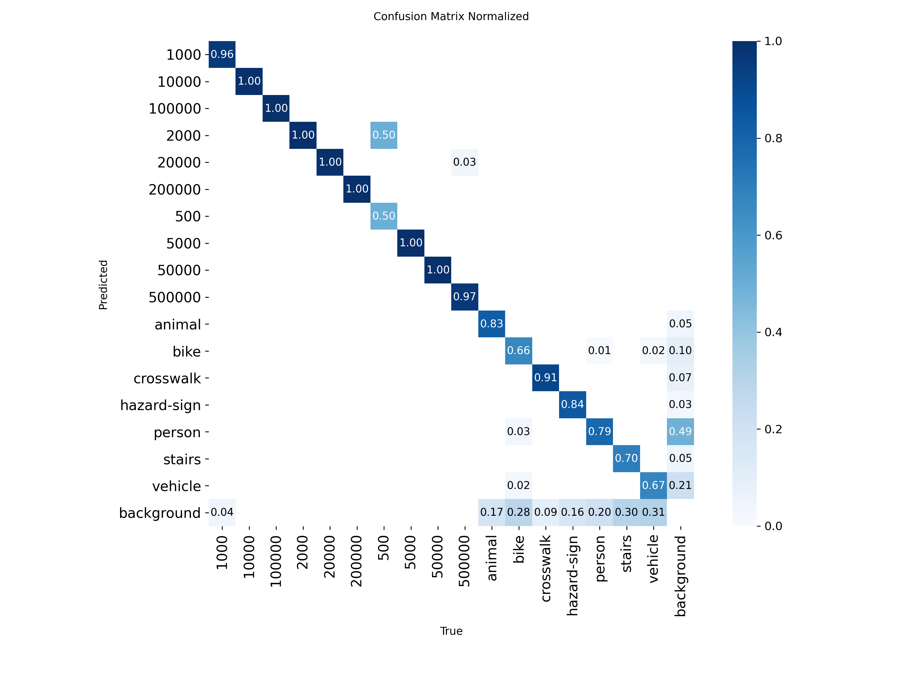
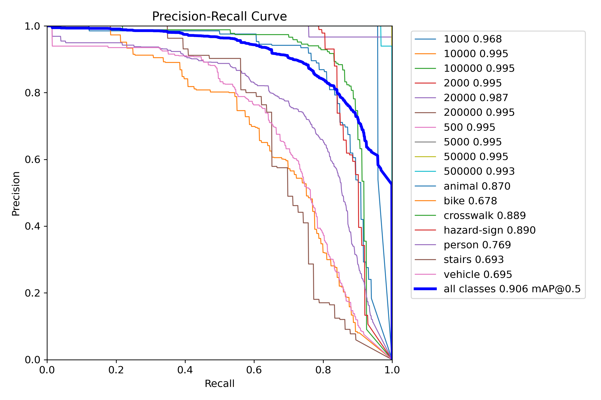

# TakAura — Real-time Handheld Money Detection

[](https://www.python.org/)
[](https://flutter.dev/)
[](https://github.com/ultralytics/ultralytics)
[](https://www.tensorflow.org/lite)
[](#roadmap)

TakAura là dự án AI + Flutter để nhận diện tiền trong điều kiện thực tế (cầm tay, góc nghiêng, che khuất nhẹ), huấn luyện bằng YOLOv8 và triển khai trên mobile bằng TensorFlow Lite.

📌 Xem tóm tắt tiến độ bản phát hành tại: [`RELEASE_NOTES.md`](./RELEASE_NOTES.md)

<p align="center">
	
</p>

<p align="center"><b>AI-first mobile detection pipeline cho tác vụ nhận diện tiền theo thời gian thực.</b></p>

## ✨ Highlights

- End-to-end pipeline: **Dataset → Train → Export TFLite → Flutter app**
- Preset augmentation tối ưu cho tiền cầm tay (occlusion, perspective, mixup nhẹ)
- Script export TFLite có xử lý lỗi thân thiện và tự tìm `best.pt` mới nhất
- Cấu trúc repo rõ ràng cho cả team AI và mobile

## 🎬 Demo & Results

| Training Curves | Label Distribution |
|---|---|
|  |  |

| Confusion Matrix (Normalized) | PR Curve |
|---|---|
|  |  |

> Tip: Bạn có thể thay các ảnh này bằng GIF demo app trong `assets/readme/` để README sống động hơn.

## 🧱 Project Structure

```text
ai_training/
├── train_takaura.py                      # Train YOLOv8 với preset robust
├── export_tflite.py                      # Export model sang TFLite (fp16/int8)
├── requirements.txt
├── datasets/
│   ├── tak_aura_master/
│   ├── money/
│   └── obstacles/
└── tak_aura_app/                         # Flutter app chạy model on-device
	├── lib/
	├── assets/models/
	└── pubspec.yaml
```

## 🚀 Quick Start (Training)

```powershell
Set-Location d:\TakAura_Project\ai_training
python -m venv .venv
.\.venv\Scripts\Activate.ps1
pip install -r requirements.txt
python train_takaura.py --data ai_training/datasets/tak_aura_master/data.yaml --epochs 80 --imgsz 640
```

Model sẽ được lưu trong `runs/detect/<run_name>/weights/`.

## 📦 Export to TFLite

```powershell
Set-Location d:\TakAura_Project\ai_training
.\.venv\Scripts\Activate.ps1
python export_tflite.py --mode fp16
```

Kết quả được copy vào:

- `ai_training/tak_aura_app/assets/models/takaura_fp16.tflite` hoặc
- `ai_training/tak_aura_app/assets/models/takaura_int8.tflite`

## 📱 Flutter App Run

```powershell
Set-Location d:\TakAura_Project\ai_training\tak_aura_app
flutter pub get
flutter run
```

Yêu cầu tối thiểu:

- File model trong `assets/models/`
- File nhãn `assets/models/labels.txt`

## 🔁 Training Preset (Current)

`train_takaura.py` đang dùng preset giúp mô hình bền hơn trong bối cảnh thực:

- `cos_lr=True`, `close_mosaic=10`
- `mosaic=0.65`, `mixup=0.12`, `copy_paste=0.10`
- `degrees=8.0`, `translate=0.10`, `scale=0.35`
- `hsv_s=0.75`, `hsv_v=0.45`, `erasing=0.40`

## 📊 Benchmark Snapshot

- Nguồn metrics chính: `runs/detect/runs/detect/takaura_v1/results.csv` (epoch `50`).
- Nguồn biểu đồ: `assets/readme/results.png`, `assets/readme/confusion_matrix_normalized.png`, `assets/readme/box_pr_curve.png`.

| KPI | Value |
|---|---:|
| Epoch | 50 |
| Precision | 0.92112 |
| Recall | 0.86008 |
| mAP50 | 0.90579 |
| mAP50-95 | 0.77615 |
| `best_float16.tflite` size | 5.82 MB |
| `takaura_fp16.tflite` size | 11.56 MB |

> Ghi chú: số liệu lấy từ run tốt nhất đã lưu trong repo local tại thời điểm tổng hợp.

## ⚠️ Known Issues

- Có nhiều `results.csv` trong workspace; nếu chọn nhầm run thì KPI dễ bị lệch (ví dụ run `train` có metrics bằng `0`).
- Chưa có benchmark latency chuẩn hóa theo thiết bị (Android tầm trung/cao) trong cùng điều kiện input.
- Thiếu demo GIF/video inference trực tiếp trong app nên phần showcase chưa phản ánh UX runtime.
- Một số cảnh báo Git trên Windows (`LF/CRLF`, unreachable loose objects) chưa ảnh hưởng chức năng nhưng nên dọn để workflow sạch hơn.

## 🧪 Next Experiments

- So sánh `fp16` vs `int8` theo 3 tiêu chí: mAP50-95, latency, memory footprint trên cùng thiết bị.
- Chạy ablation cho augmentation (`mosaic`, `mixup`, `copy_paste`, `erasing`) để tìm preset tối ưu theo từng denomination.
- Bổ sung tập ảnh khó (blur mạnh, backlight, che khuất > 40%) và đo lại confusion matrix theo lớp.
- Thiết lập bộ KPI release cố định: `mAP50`, `mAP50-95`, FPS trung bình, P95 latency, model size.
- Thêm `demo.gif` từ app vào `assets/readme/` để README phản ánh đúng hiệu năng thực tế.

## 🧠 Architecture Flow

```text
Dataset (YOLO format)
	-> train_takaura.py (YOLOv8 + robust augmentations)
	-> best.pt
	-> export_tflite.py (fp16/int8)
	-> tak_aura_app/assets/models/*.tflite
	-> Flutter Camera + TFLite Inference + UI Overlay
```

## 🛣️ Roadmap

- [x] Huấn luyện YOLOv8 baseline
- [x] Export TFLite và tích hợp vào Flutter assets
- [x] Camera flow + inference service trong app
- [ ] Đánh giá thêm mAP/F1 theo từng denomination
- [ ] Tối ưu latency và memory cho thiết bị tầm trung
- [ ] Thêm demo GIF/video inference trực tiếp từ app

## 🤝 Contributing

1. Tạo branch từ `master`
2. Commit theo nhóm thay đổi rõ ràng
3. Mở Pull Request mô tả mục tiêu + kết quả test

## 📄 Notes

- Repo này tập trung vào ứng dụng thực tế và iteration nhanh.
- Có thể điều chỉnh nhanh tham số train qua CLI trong `train_takaura.py`.
